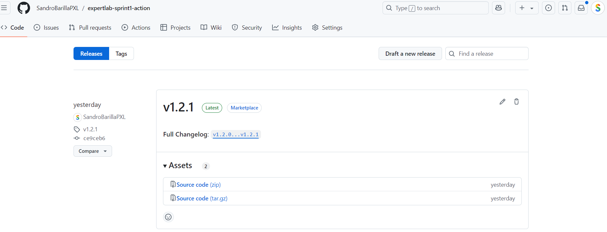

## :sparkles: Creating the action
`action.yml` describes the action; which environment it runs in, what inputs it accepts, and what outputs it produces. `action.js` is where the actual program is written. It has two dependencies from GitHub Actions itself, which is why the `node_modules`folder is included in this repo.

## :globe_with_meridians: Publishing the action
The action is published to the [GitHub Marketplace](https://github.com/marketplace/actions/expertlab-sprint1-action) by creating a release. The release is tagged with a version number, which is used in a workflow file to specify which version of the action to use. GitHub automatically detects this as a publishable action, so it suggests to publish it to the Marketplace.   
 
 
The metadata for this published action is described in `marketplace.yml`.  
 